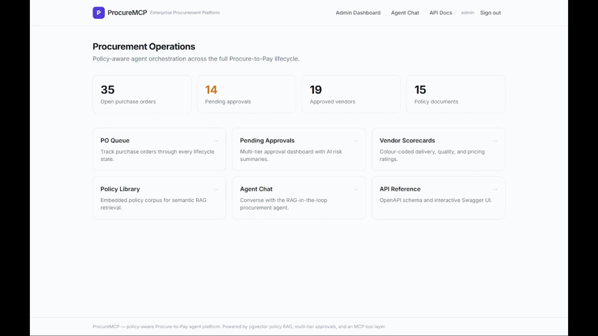
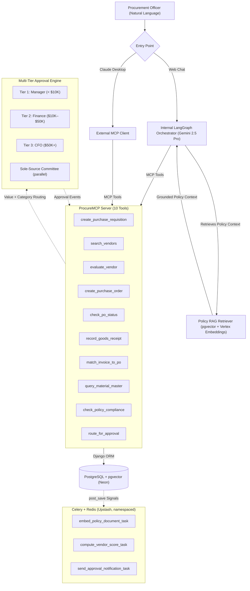

# ProcureMCP

**Enterprise procurement agent platform where a policy-aware LLM agent orchestrates the full Procure-to-Pay lifecycle — requisition, vendor selection, PO creation, goods receipt, and invoice matching — through natural language, with pgvector-backed policy RAG and multi-tier human-in-the-loop approvals.**

The procurement domain lives in Django. Atomic procurement operations are exposed as **MCP tools**, and two independent agents consume the same tools — an internal LangGraph orchestrator and any external MCP client such as Claude Desktop — proving the MCP layer is genuinely agent-framework agnostic.



---

## Architecture



---

## Tech stack

| Layer | Technology |
|---|---|
| Backend | Django 5 + Django REST Framework |
| Database | PostgreSQL + **pgvector** (Neon serverless) |
| Vector search | pgvector HNSW, cosine similarity |
| Embeddings | Google Vertex AI `text-embedding-004` (768-dim) |
| MCP server | Python `mcp` SDK (stdio + SSE) |
| Agent | LangGraph state machine, RAG-in-the-loop |
| Reasoning LLM | Google **Gemini 2.5 Pro** (Vertex AI) |
| Approvals | Custom multi-tier engine + `django-fsm` |
| Async | Celery + Redis (Upstash, namespaced via `global_keyprefix`) |
| Frontend | Django templates + Tailwind CDN, vanilla JS SSE |
| Packaging | `uv` |
| Deploy | Railway + Neon + Upstash |

---

## MCP tool reference

| Tool | Purpose |
|---|---|
| `create_purchase_requisition` | Draft a PR with line items, cost center, justification |
| `search_vendors` | Search vendor master by material group, min score, region |
| `evaluate_vendor` | Scorecard: delivery %, quality, pricing, PO count, risk flags, recommendation |
| `create_purchase_order` | Convert approved PR → PO; runs policy RAG + approval routing (returns `hitl_pending`) |
| `check_po_status` | Lifecycle state + audit-event timeline |
| `record_goods_receipt` | Log GR per line and advance PO state |
| `match_invoice_to_po` | Three-way match (PO × GR × invoice), flag discrepancies |
| `query_material_master` | Material specs, stock, reorder point, lead time |
| `check_policy_compliance` | pgvector RAG query, returns cited policy snippets + assessment |
| `route_for_approval` | Multi-tier approval routing by value (+ sole-source committee) |

See [docs/mcp_tools_reference.md](docs/mcp_tools_reference.md) for argument details.

## Approval workflows

Value-based routing (see [docs/approval_workflows.md](docs/approval_workflows.md)):

| PO value | Approver tier |
|---|---|
| `< $10,000` | Manager |
| `$10,000 – $49,999` | Finance |
| `≥ $50,000` | CFO |
| Sole-source | Parallel **sole-source committee** review, in addition to the value tier |

The PO lifecycle is a `django-fsm` state machine: `draft → pending_approval → approved → sent_to_vendor → partially_received | fully_received → invoiced → closed` (with `rejected` / `cancelled` terminal states). Invalid transitions raise `TransitionNotAllowed`.

## Policy RAG design

Policy documents are embedded on creation (via a `post_save` signal that queues a Celery task) or in bulk via the `embed_policies` command. Retrieval embeds the query with the same model and runs an HNSW cosine search. Details in [docs/policy_rag_design.md](docs/policy_rag_design.md).

---

## Local setup

Prerequisites: [`uv`](https://docs.astral.sh/uv/), a Neon PostgreSQL database with the `vector` extension enabled (`CREATE EXTENSION IF NOT EXISTS vector;`), an Upstash Redis database, and a Google Cloud service account with Vertex AI access.

```bash
uv venv --python 3.10 && uv sync
cp .env.example .env                          # fill in DATABASE_URL, REDIS_URL, GCP creds, DJANGO_SECRET_KEY
uv run python manage.py migrate
uv run python manage.py seed_data
uv run python manage.py createsuperuser
uv run python manage.py embed_policies --sync # embed the policy corpus
uv run python manage.py runserver
```

Open `http://localhost:8000/` (landing page), `/chat/` (agent chat), `/admin/` (Django Admin), or `/api/docs/` (Swagger UI).

Optional async worker, for background embedding/scoring:

```bash
uv run celery -A procuremcp worker --loglevel=info
```

> **Shared Redis:** `REDIS_URL` points to a shared Upstash database. All Celery keys are namespaced with `global_keyprefix: 'procuremcp:'` (set in `procuremcp/celery.py`) so they never collide with other projects on the same instance.

---

## Running the MCP server

```bash
# stdio transport (desktop / local MCP clients)
uv run python manage.py run_mcp_server

# SSE transport (networked agents)
uv run python manage.py run_mcp_server --transport sse --port 8001
```

### Claude Desktop integration

Add the server to your Claude Desktop config
(`%APPDATA%\Claude\claude_desktop_config.json` on Windows,
`~/Library/Application Support/Claude/claude_desktop_config.json` on macOS):

```json
{
  "mcpServers": {
    "procuremcp": {
      "command": "uv",
      "args": ["run", "python", "manage.py", "run_mcp_server"],
      "cwd": "/absolute/path/to/ProcureMCP",
      "env": {
        "DJANGO_SETTINGS_MODULE": "procuremcp.settings"
      }
    }
  }
}
```

Restart Claude Desktop; all 10 procurement tools become available and run against the same Django backend as the internal agent.

---

## Deployment (Railway)

The repo includes a `Procfile` and `runtime.txt`. Provision Neon (pgvector) and reuse the shared Upstash Redis.

1. Create a Railway project from this repository.
2. Set environment variables: `DATABASE_URL`, `REDIS_URL`, `DJANGO_SECRET_KEY`, `GOOGLE_CLOUD_PROJECT`, `GOOGLE_CLOUD_LOCATION`, and `GCP_CREDENTIALS_JSON` (the full service-account JSON — it is written to a temp file at startup). Setting `RAILWAY_ENVIRONMENT` forces `DEBUG=False` and production security settings.
3. Enable `vector` on the Neon database once (`CREATE EXTENSION IF NOT EXISTS vector;`).
4. The `web` process runs migrations and `collectstatic` on boot, then serves via Gunicorn. Run `python manage.py seed_data` and `python manage.py embed_policies --sync` once as a one-off command.
5. Optionally enable the `worker` (Celery) and `mcp` (SSE server) processes.

`Procfile`:

```
web: python manage.py migrate --noinput && python manage.py collectstatic --noinput && gunicorn procuremcp.wsgi --bind 0.0.0.0:$PORT
worker: celery -A procuremcp worker --loglevel=info
mcp: python manage.py run_mcp_server --transport sse --port 8001
```

---

## Project layout

```
procuremcp/        Django project config (settings, celery, urls)
procurement/       Core app: models, admin, DRF API, signals, tasks,
                   approval engine, state machine, management commands
mcp_server/        MCP server (server.py) and the 10 tool implementations (tools.py)
agent/             LangGraph orchestrator: graph, nodes, retriever, mcp_client, prompts
frontend_minimal/  Django templates + static assets (landing + chat)
docs/              Architecture, MCP tools, approval workflows, policy RAG notes
```

## Testing

```bash
uv run python manage.py test procurement --keepdb
```

(The `--keepdb` flag avoids a teardown race on serverless Postgres poolers.)
